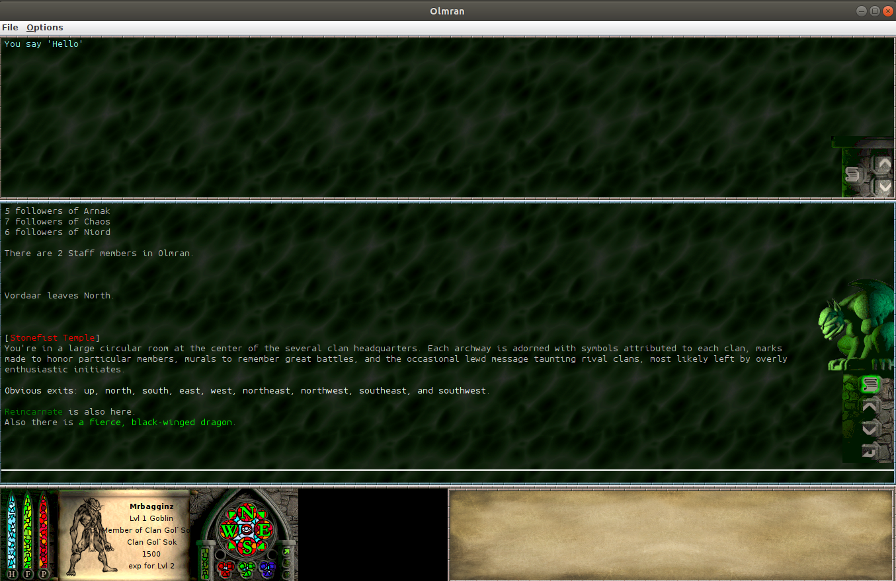

# DFC Client Clone

This was a custom client I wrote when I worked on the "ProjectDF" project, which was a community driven reboot of an old
MUD (Multi-User Dungeon), [Darkness Falls: The Crusade](https://en.wikipedia.org/wiki/Darkness_Falls:_The_Crusade)
. It was still very much a work in progress when I left the project, 
but was (and I 
believe still is) being used by the players participating in the on-going development of the game.

The artwork was used from the original game which was abandoned many years ago, and meant to be used as filler (and not
very serious) until we had our own custom artwork, so all credit goes to the original artists from the game.

A couple nerdy things I did that I found to be kind of interesting:
 - I used [GMCP protocol](https://www.gammon.com.au/gmcp) slightly differently than intended. Since I also helped with
 development on the server side, I was able to implement GMCP messages from the server in specific places and set up
 a "handler" style system for processing GMCP messages from the server to trigger UI element. For example, if a player
 takes damage, the server will send a GMCP message back to the client with the players hp value, and the health bar would
 update accordingly in the UI.
 - I learned a lot about Telnet... which is cool I guess
 - We used Telnet subnegotiation to enforce the use of our custom client vs other generic MUD clients like [Mudlet](https://www.mudlet.org/)
 and [MUDRammer](https://splinesoft.net/mudrammer/) to prevent the use of things like triggers and other easy-to-use automation,
 since the game is so focused around PVP.
 - Old games don't scale well on modern screen resolutions
 - I'm not much of a UI Developer :-)
 
 
 **Login Window**  
 
 
 **In game: Chaos Realm**   
 
 
 **Evil Realm**  
 